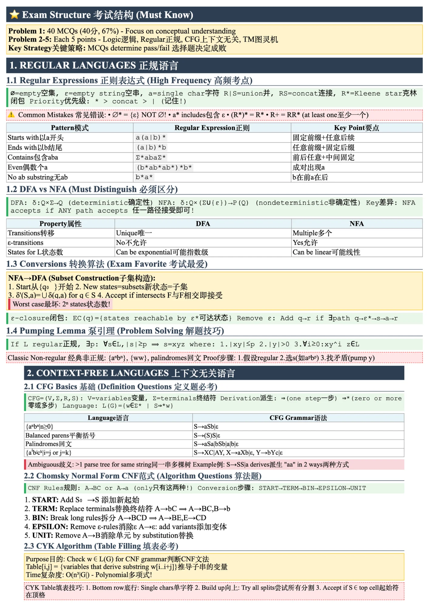
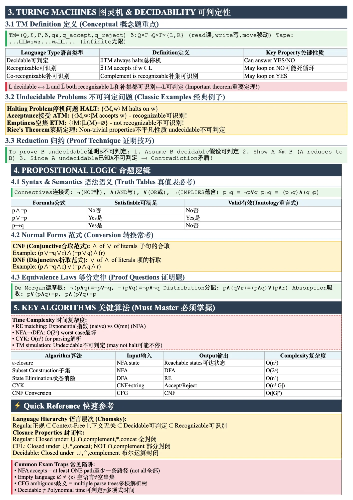

# COMP2022 - Models of Computation

## Course Information
- **Course Code:** COMP2022
- **Course Name:** Models of Computation
- **University:** University of Sydney
- **Semester:** 2024 S2

## Cheatsheet Contents

### Page 1 (COMP2022_1.png)
- Exam Structure Overview
- Regular Languages
  - Regular Expressions
  - Common Patterns
  - DFA vs NFA Comparison
- NFA→DFA Conversion (Subset Construction)
- ε-closure
- Pumping Lemma
- Context-Free Languages
  - CFG Basics
  - Chomsky Normal Form (CNF)
  - CYK Algorithm

### Page 2 (COMP2022_2.png)
- Turing Machines & Decidability
  - TM Definition
  - Decidable vs Recognizable
  - Undecidable Problems (HALT, ATM, ETM)
  - Rice's Theorem
- Reduction Technique
- Propositional Logic
  - Truth Tables
  - Normal Forms (CNF, DNF)
  - Equivalence Laws
- Key Algorithms Summary
- Language Hierarchy (Chomsky)

## Preview

| Page 1 | Page 2 |
|--------|--------|
|  |  |

## Key Topics Summary

### Regular Languages
- **RE Priority:** `*` > `concat` > `|`
- **NFA accepts:** If ANY path accepts (at least one path)
- **DFA states:** Can be exponential O(2ⁿ) in worst case

### Context-Free Languages
- **CFG ambiguity:** Multiple parse trees for same string
- **CNF Rules:** A→BC or A→a only
- **CYK Complexity:** O(n³|G|)

### Decidability
- **Decidable ⟺** L and L̄ both recognizable
- **HALT problem:** Undecidable
- **Reduction:** To prove B undecidable, show A ≤ₘ B

### Propositional Logic
- **De Morgan:** ¬(p∧q) ≡ ¬p∨¬q
- **Distribution:** p∧(q∨r) ≡ (p∧q)∨(p∧r)

## Common Exam Traps

⚠️ **Watch out for:**
- NFA accepts = at least ONE path (not all)
- Empty language ∅ ≠ {ε} (empty string set)
- CFG ambiguity = multiple parse trees
- Decidable ≠ Polynomial time

---

[← Back to Main Repository](../README.md)
