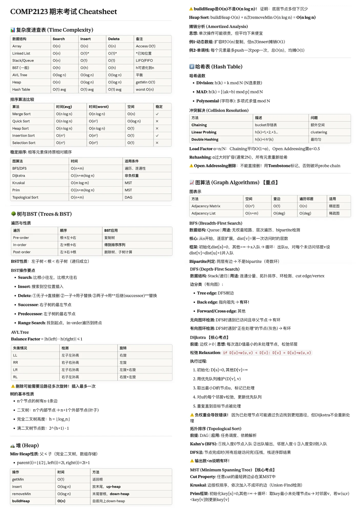
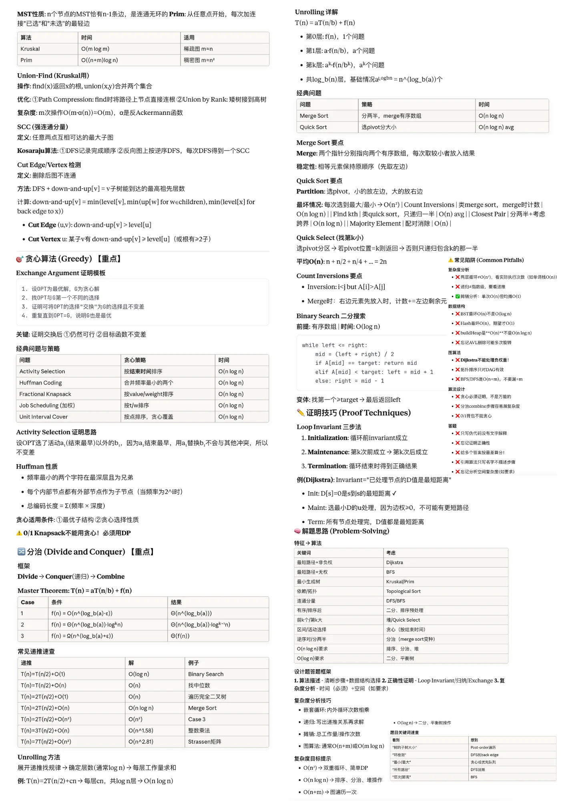

# COMP2123 - Data Structures and Algorithms

## Course Information
- **Course Code:** COMP2123
- **Course Name:** Data Structures and Algorithms
- **University:** University of Sydney
- **Semester:** 2024 S2

## Cheatsheet Contents

### Page 1 (COMP2123_1.png)
- MST Properties (Kruskal, Prim)
- Union-Find (Kruskal)
- SCC (Kosaraju's Algorithm)
- Cut Edge/Vertex Detection
- Greedy Algorithms
- Divide and Conquer
- Master Theorem
- Quick Sort & Quick Select
- Binary Search
- Loop Invariant Proof Techniques

### Page 2 (COMP2123_2.png)
- Time Complexity Reference Table
- Sorting Algorithm Comparison
- Trees & BST Operations
- AVL Tree Rotations
- Heap Operations
- Hash Table (Collision Resolution)
- Graph Algorithms (BFS, DFS, Dijkstra)
- Topological Sort
- Minimum Spanning Tree

## Preview

| Page 1 | Page 2 |
|--------|--------|
|  |  |

## Key Topics Summary

- **Complexity Analysis:** Big-O, Big-Θ, Big-Ω notation
- **Sorting:** Merge Sort O(n log n), Quick Sort O(n log n) avg, Heap Sort O(n log n)
- **Graph Traversal:** BFS O(n+m), DFS O(n+m)
- **Shortest Path:** Dijkstra O((n+m) log n)
- **MST:** Kruskal O(m log m), Prim O((n+m) log n)
- **BST Operations:** Search/Insert/Delete O(h)
- **Hash Table:** Average O(1), Worst O(n)

## Usage Tips

1. Print both pages for comprehensive coverage
2. Focus on time complexity for algorithm selection questions
3. Memorize the key invariants for proof questions
4. Practice drawing data structures (trees, graphs) by hand

---

[← Back to Main Repository](../README.md)
