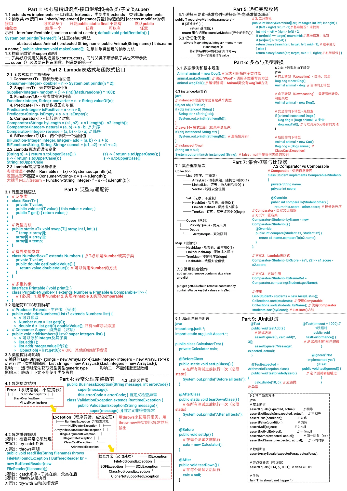
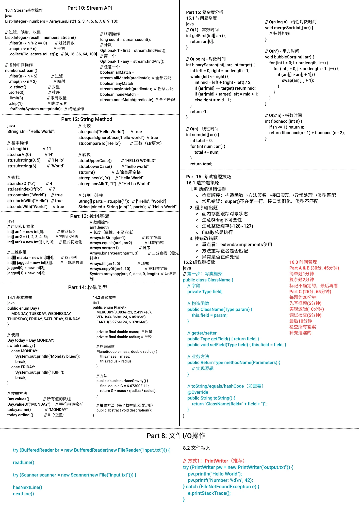

# INFO1113 - Object-Oriented Programming

## Course Information
- **Course Code:** INFO1113
- **Course Name:** Object-Oriented Programming
- **University:** University of Sydney
- **Semester:** 2024 S2

## Cheatsheet Contents

### Page 1 (INFO1113_1.png)
- Core Concepts
  - extends vs implements
  - Abstract Class vs Interface
  - super() Usage
- Lambda Expressions
  - Consumer, Supplier, Function, Predicate
  - Comparator & BiFunction
- Generics
  - Type Parameters
  - Bounded Types
  - PECS Principle (Producer Extends, Consumer Super)
- Exception Handling
  - Try-catch-finally
  - Checked vs Unchecked Exceptions
  - Custom Exceptions
- Polymorphism
  - instanceof Operator
  - Type Casting (Upcasting/Downcasting)

### Page 2 (INFO1113_2.png)
- Collections Framework
  - List (ArrayList, LinkedList)
  - Set (HashSet, LinkedHashSet, TreeSet)
  - Map (HashMap, LinkedHashMap, TreeMap)
  - Queue (PriorityQueue, Deque)
- Comparable vs Comparator
- JUnit Testing
  - @Test, @BeforeClass, @AfterClass
  - @Before, @After
  - Assert Methods
- Stream API
  - Intermediate Operations (filter, map, sorted)
  - Terminal Operations (collect, count, findFirst)
- String Methods
- Array Operations
- File I/O
- Time Complexity Analysis
- Exam Strategy & Time Management

## Preview

| Page 1 | Page 2 |
|--------|--------|
|  |  |

## Key Topics Summary

### OOP Fundamentals
- **Interface:** Contract only, multiple inheritance allowed
- **Abstract Class:** Can have implementation, single inheritance
- **super():** Must be first line in constructor

### Generics
```java
// Bounded type
<T extends Number>  // T must be Number or subclass
// Wildcards
<? extends T>  // Producer - read only
<? super T>    // Consumer - write only
```

### Collections Time Complexity
| Operation | ArrayList | LinkedList | HashSet | TreeSet |
|-----------|-----------|------------|---------|---------|
| Access    | O(1)      | O(n)       | -       | -       |
| Search    | O(n)      | O(n)       | O(1)    | O(log n)|
| Insert    | O(n)*     | O(1)       | O(1)    | O(log n)|

### Lambda Quick Reference
```java
// Consumer - takes input, no return
x -> System.out.println(x)

// Supplier - no input, returns value
() -> Math.random()

// Function - takes input, returns output
x -> x * 2

// Predicate - takes input, returns boolean
x -> x > 0
```

## Exam Tips

1. **MCQ Strategy:** Read all options before answering
2. **Code Tracing:** Draw memory diagrams, track object state
3. **Error Finding:** Focus on extends/implements, method signatures
4. **Time Management:** Part A (30 min), Part B (30 min), Part C (65 min)

---

[← Back to Main Repository](../README.md)
